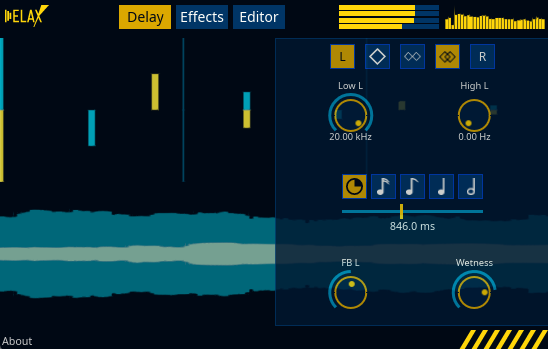

# Delax



Delax is a delay plugin built for vast soundscapes stemming from a pipeline of effects and the ability to slice the delay buffer.

## Building

After installing [Rust](https://rustup.rs/), you can compile Delax as follows:

```shell
cargo xtask bundle delax --release
```
